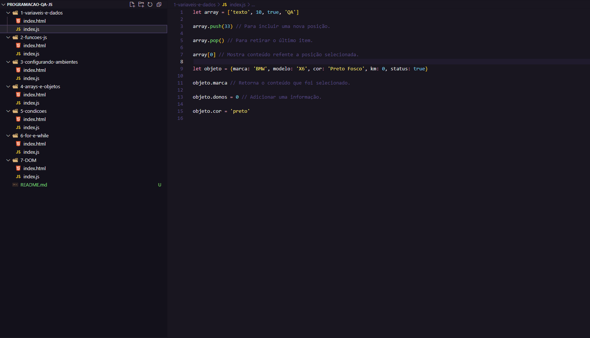

# 💻 Programming for QA

[](https://github.com/PedroAraujoBOliveira/javascript-para-qa)
[](https://github.com/PedroAraujoBOliveira/javascript-para-qa)
[](https://www.linkedin.com/in/pedroaraujoboliveira/)
[](./LICENSE)

This repository documents my learning journey in **JavaScript**, focusing on **test automation for Quality Assurance (QA)**.  
It serves both as a study portfolio and as a guide for anyone starting in QA with a focus on frontend automation. 🚀



---

## 🛠 Technologies Used

- `HTML`
- `JavaScript`
- `Node.js` (environment to run JS on the terminal)
- `Visual Studio Code`

---

## 📚 Topics Studied

The content is organized into folders following the learning sequence:

| Module | Topic                         | Status      |
|--------|-------------------------------|-------------|
| 1️⃣     | Variables and Data Types       | ✅ Completed |
| 2️⃣     | Functions in JavaScript        | ✅ Completed |
| 3️⃣     | Setting Up Environments        | ✅ Completed |
| 4️⃣     | Arrays and Objects             | ✅ Completed |
| 5️⃣     | Conditionals                   | ✅ Completed |
| 6️⃣     | Loops (for, while)              | ✅ Completed |
| 7️⃣     | DOM Manipulation                | ✅ Completed |

---

## ▶️ How to Use

1. **Clone the repository:**
   ```bash
   git clone https://github.com/PedroAraujoBOliveira/javascript-para-qa.git
   ```

2. **Navigate into the project folder:**
   ```bash
   cd javascript-para-qa
   ```

3. **Choose the folder corresponding to the topic you want to study:**
   ```bash
   cd 4-arrays-e-objetos
   ```

4. **To view the content:**
   - If it's an `.html` file, open it directly in your browser (double-click or drag the file into your browser).
   - If it's a `.js` file, run it in the terminal using Node.js:
     ```bash
     node file-name.js
     ```

5. **If you don't have Node.js installed:**
   - Visit [Node.js official website](https://nodejs.org/) and install it to be able to run `.js` files locally.

**Tip:** Use Visual Studio Code to make it easier to navigate and edit the files.

## 📌 Goal

Consolidate the essential JavaScript fundamentals for QA automation, laying the groundwork for tools like Cypress, Playwright, Selenium, among others.

---

## 📈 Next Steps

- [ ] Build a test base using Cypress
- [ ] Automate tests in a simple application
- [ ] Add API testing using JavaScript
- [ ] Integrate studies with CI (GitHub Actions)

---

## 💡 Inspiration

This project was born from the need to have a strong programming foundation as a QA.  
The knowledge gained here is crucial for writing good test scripts and understanding application behavior during testing.

---

## 📨 Contact

Feel free to connect, give feedback, or follow my journey:

- [LinkedIn](https://www.linkedin.com/in/pedroaraujoboliveira/)
- [GitHub](https://github.com/PedroAraujoBOliveira)